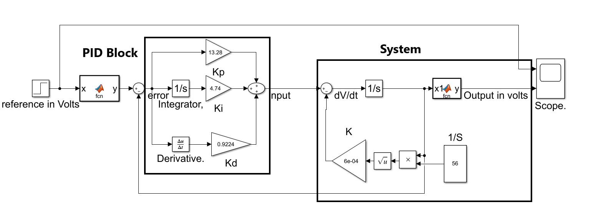
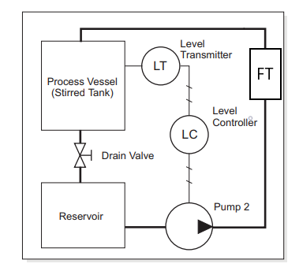
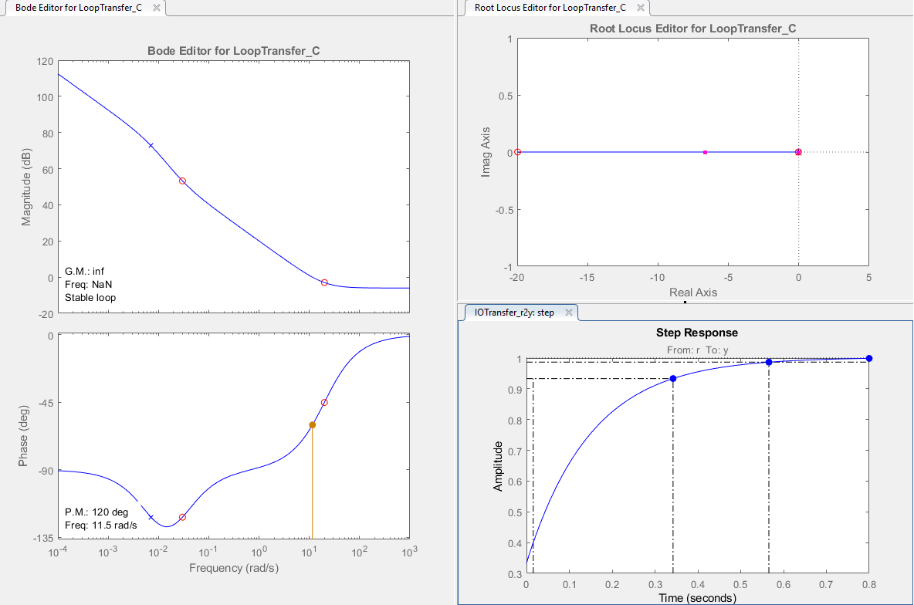
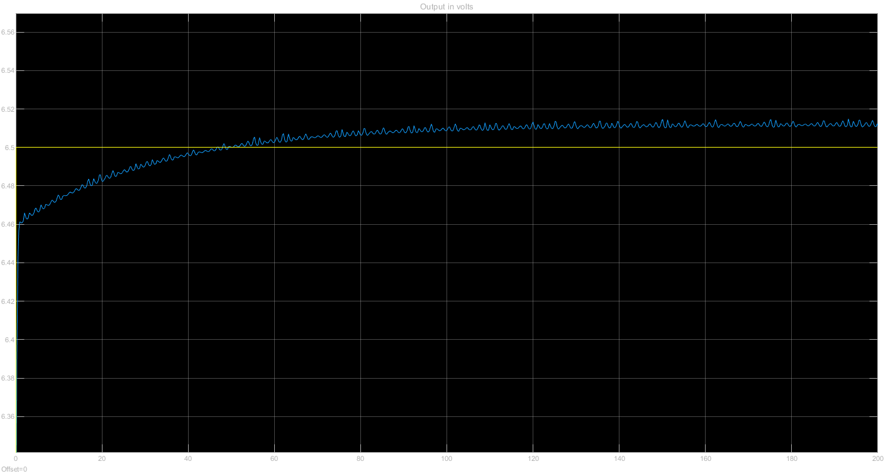

This repository contains:

- Matlab and Simulink Files used to model the system and tune the PID values (/slprj)
- Various figures of simulation results and experimental results
- A report of the experiment

Model of the experimental setup:

Closed Loop Experimental setup:

Tuning of PID values based on simulated system:

Step response of tuned values:

